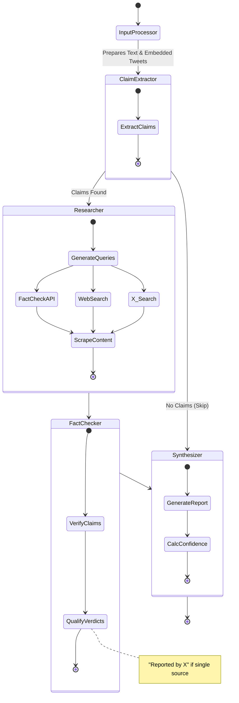
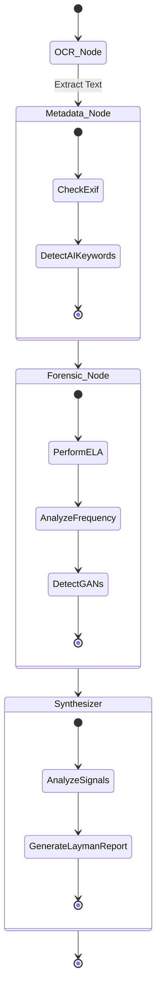

# SatyaScan 🔍️

An AI-powered browser extension that helps you verify news, detect misinformation, and analyze images for manipulation (Deepfakes/AI-Generation) in real-time.

## Features 🚀


*The main extension interface showing the analysis capabilities.*

-   **Page Scan**: Instantly analyze the current webpage for factual accuracy.
    
    

    *Real-time analysis of the entire webpage content for misinformation.*

-   **Text Verification**: Highlight any text, right-click, and verify it.
    
    

    *Context menu integration allowing verification of specific text selections.*

    

    *Right-click context menu to initiate verification.*

    

    *Analysis results displayed after verifying the selected text.*

-   **Image Forensics**:
    -   **Deepfake Detection**: Scans for AI signatures (Midjourney, Stable Diffusion).
    -   **Manipulation Check**: Uses Error Level Analysis (ELA) to find edited regions.
    -   **OCR**: Extracts text from images/screenshots and fact-checks it.
    
    

    *Detailed image analysis showing deepfake detection and forensic checks.*

-   **Smart History**: Saves your scans locally for easy reference.
    
    

    *Local history of all previous scans for quick access.*

-   **Privacy Focused**: Runs analysis on demand; no background tracking.

## Setup Guide 🛠️

### 1. Backend Setup (Python)

The backend runs the AI agents and forensic tools.

1.  **Prerequisites**:
    -   Python 3.14.0
    -   **Tesseract OCR**: Download and install from [UB-Mannheim/tesseract/wiki](https://github.com/UB-Mannheim/tesseract/wiki).
        -   *Note*: Ensure it is installed at `C:\Program Files\Tesseract-OCR\tesseract.exe` or update the path in `backend/app/services/ocr_service.py`.

2.  **Virtual Environment Setup**:
    Open a terminal in the project root (`c:\Projects\Misinformation_MH`) and run:
    ```bash
    # Create venv (ensure you are in the backend directory or adjust path)
    cd backend
    python -m venv venv
    .\venv\Scripts\activate
    ```

3.  **Install Dependencies**:
    ```bash
    pip install -r requirements.txt
    ```

4.  **Environment Variables**:
    -   Create a `.env` file in the `backend` folder.
    -   Add your API keys:
        ```env
        Add keys mentioned in the `.env.example` file.

5.  **Start the Server**:
    Run this command from the **project root**:
    ```bash
    backend\venv\Scripts\python -m uvicorn backend.app.main:app --reload
    ```
    The server will run at `http://localhost:8000`.

### 2. Extension Setup (Chrome/Edge)

1.  Open your browser and go to `chrome://extensions`.
2.  Enable **Developer Mode** (toggle in the top right).
3.  Click **Load unpacked**.
4.  Select the `extension` folder from this project.
5.  Pin the "MisinfoDetector" icon to your toolbar.

## Usage 📖

1.  **Scan a Page**: Click the extension icon and hit "Scan Page".
2.  **Verify Selection**: Highlight text on any website -> Right-click -> "Verify with MisinfoDetector".
3.  **Analyze Images**:
    -   Open the extension.
    -   Go to the **Image** tab.
    -   Drag & drop an image or click "Choose File".
    -   The agent will check for deepfakes and verify any text inside.

## System Architecture & Agentic Workflows 🧠

### 1. High-Level Architecture

The Misinformation Detector is a hybrid system composed of a Chrome Extension frontend and a robust Python/FastAPI backend powered by Agentic AI.

```mermaid
graph TD
    subgraph Frontend [Chrome Extension]
        CS[Content Script] -->|Scrapes Page/Tweets| SP[Side Panel UI]
        SP -->|Sends Text/Image| API[Backend API]
        SP -->|Displays Report| User[User]
    end

    subgraph Backend [FastAPI Server]
        API -->|/analyze| Router[API Router]
        Router -->|Text| MainAgent[Main Agent (LangGraph)]
        Router -->|Image| ImageAgent[Image Agent (LangGraph)]
        
        subgraph Services
            DB[(SQLite DB)]
            Scraper[Scraper Service]
            OCR[OCR Service]
            Forensics[Forensic Service]
        end
        
        MainAgent --> Scraper
        MainAgent --> DB
        ImageAgent --> OCR
        ImageAgent --> Forensics
    end

    subgraph External_APIs [External Services]
        MainAgent -->|Search| Tavily[Tavily / Google Search]
        MainAgent -->|Verify| GoogleFactCheck[Google Fact Check API]
        MainAgent -->|Social Context| X_API[X (Twitter) API]
        MainAgent -->|LLM| VertexAI[Google Vertex AI (Gemini)]
        ImageAgent -->|LLM| VertexAI
    end
```

### 2. Agentic Workflows

The core intelligence is driven by two distinct LangGraph workflows: one for text analysis and one for image forensics.

#### 2.1 Main Agent Workflow (Text Analysis)

This agent verifies textual claims by cross-referencing them with reputable sources and social media context.



#### 2.2 Image Agent Workflow (Forensic Analysis)

This agent analyzes images for manipulation using metadata, Error Level Analysis (ELA), and AI generation patterns.



### 3. Component Details

#### Frontend (Chrome Extension)
*   **`content.js`**: Injects into web pages to scrape article text, headlines, main images, and embedded X (Twitter) posts.
*   **`sidepanel.js`**: Manages the user interface, sends data to the backend, and renders the analysis reports.
*   **`background.js`**: Handles browser events and context menu actions.

#### Backend (FastAPI)
*   **`agent.py`**: Defines the `MainAgent` using LangGraph. It orchestrates the flow from claim extraction to final synthesis.
*   **`image_agent.py`**: Defines the `ImageAgent` for forensic image analysis.
*   **`x_service.py`**: specialized service to interact with the X API v2, handling rate limits and query optimization.
*   **`search_service.py`**: Aggregates results from Tavily, Google Custom Search, and Google Fact Check API.
*   **`forensic_service.py`**: Implements ELA (Error Level Analysis) and spectral analysis using `opencv` and `scikit-learn`.

#### External Integrations
*   **Google Vertex AI (Gemini 1.5 Pro)**: The primary LLM for reasoning, claim extraction, and report generation.
*   **Tavily / Google Search**: Provides real-time web information for verification.
*   **X API**: Fetches recent social media context to see how news is spreading or being debated.

---
*Built for the Mumbai Hacks 2025 Hackathon.*
